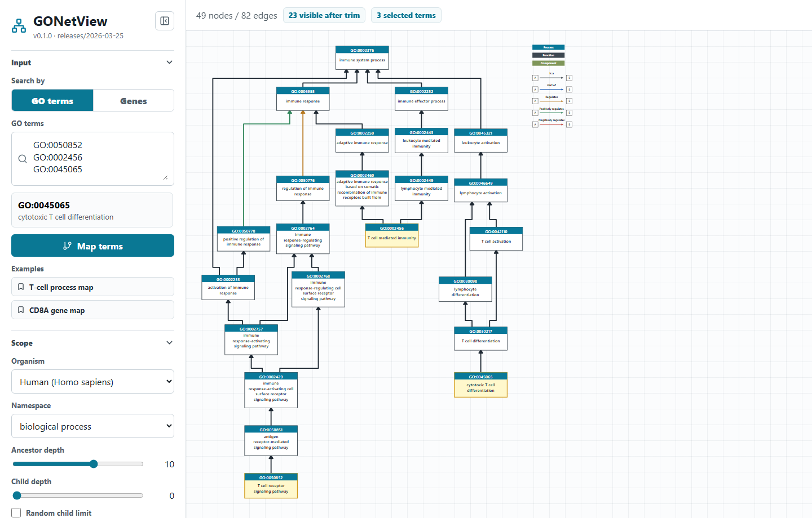
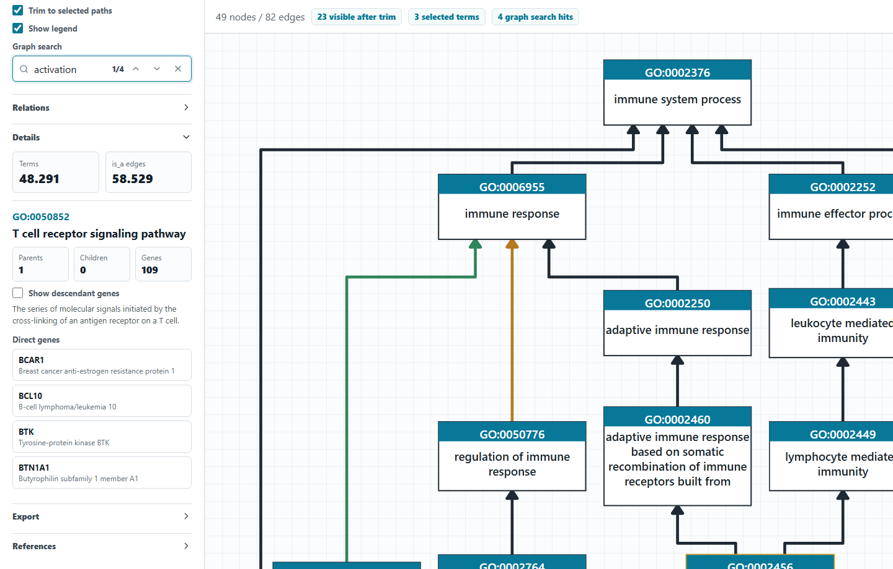
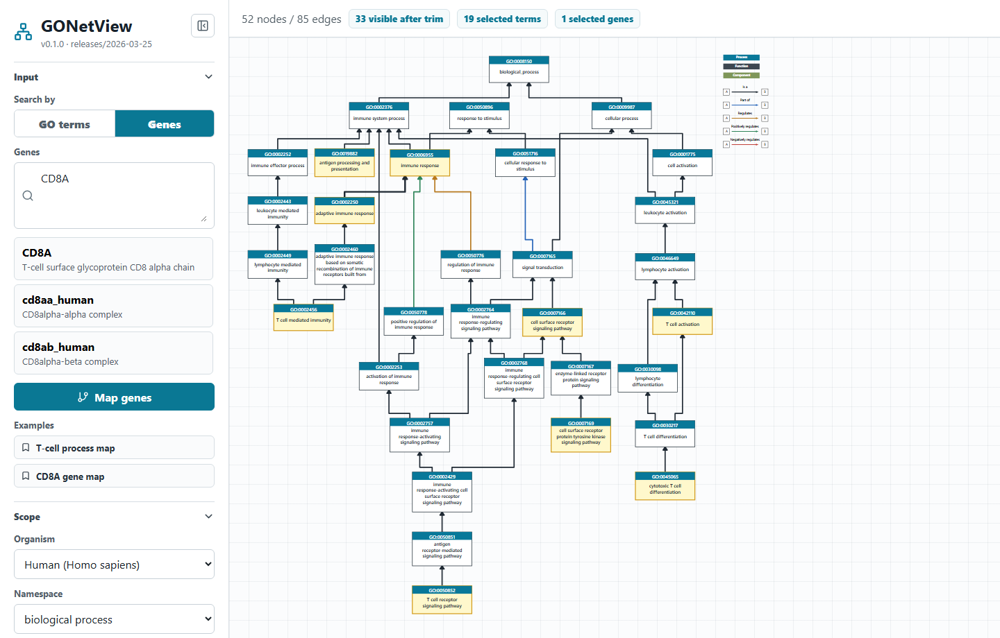
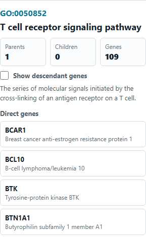

# Tutorial: Explore A Human T-Cell GO Network

This tutorial walks through a reproducible GONetView workflow using bundled Gene Ontology and human annotation data.

## Goal

Inspect three human biological-process terms that belong to the same T-cell biology neighborhood but do not form one straight parent-child chain:

```text
GO:0050852  T cell receptor signaling pathway
GO:0002456  T cell mediated immunity
GO:0045065  cytotoxic T cell differentiation
```

These terms connect through several shared immune-system and cell-activation parents. With deeper parent expansion and trimming, the graph stays readable while still showing a real network with branches.

## Open The App

Run a local preview:

```powershell
.\run-dev.cmd
```

Open the printed local URL, usually:

```text
http://127.0.0.1:5174/
```

You can also use the hosted app:

```text
https://jonasmarx3007.github.io/GONetView/
```

## Map GO Terms

Use **GO terms** mode and paste:

```text
GO:0050852
GO:0002456
GO:0045065
```

Use these plotting options:

| Option | Value | Why it matters |
| --- | --- | --- |
| Organism | `Human (Homo sapiens)` | Enables human gene counts and gene lists in the details panel. |
| Namespace | `biological_process` | Keeps the example focused on process terms. |
| Ancestor depth | `10` | Adds enough parent context for the selected T-cell terms to meet through multiple shared paths. |
| Child depth | `0` | Keeps the graph focused on the selected terms and their parents. |
| Layout | `Readable` | Uses the clearer layered graph layout. |
| Fit | `Fit height` | Frames the graph vertically in the viewport. |
| Trim to selected paths | On | Removes side branches that do not help connect the selected terms. |
| Relations | `is_a`, `part_of`, `regulates`, `positively_regulates`, `negatively_regulates` | Shows hierarchy plus the most useful process relations. |
| Show legend | On | Keeps relation and namespace colors visible. |

Then click **Map terms**.

## Expected Result

The graph should show a compact, branched T-cell process network. The selected terms connect through nodes such as T cell activation, lymphocyte activation, immune effector process, activation of immune response, immune response, and immune system process.



## Important Plotting Options

**Ancestor depth** controls how far upward from the selected terms GONetView walks through the ontology. Higher values add broader parent terms and can reveal where selected terms connect.

**Child depth** controls how far downward from selected terms the graph expands. Increase it when you want to inspect more specific descendants, but keep it low for readable overview figures.

**Relations** controls which edge types are included. `is_a` shows the main ontology hierarchy. Other relation types such as `part_of`, `regulates`, `positively_regulates`, `negatively_regulates`, and `occurs_in` can reveal non-hierarchical context, but they also make the graph denser.

**Trim to selected paths** hides nodes and edges that are not needed to connect the selected terms. This is useful when a graph becomes too large after increasing depth or enabling more relation types.

**Layout and fit** change how the graph is arranged and framed. `Readable` is usually best for figures; `Classic` is useful for a simpler row-based view. `Fit height` favors vertical ontology paths, while `Fit width` is helpful for wide graphs.

**Graph search** works like browser find: it highlights matching nodes, shows a hit counter, and lets you jump between hits.

## Search Inside The Graph

Use **Graph search** in the layout section and enter:

```text
activation
```

The search box receives keyboard focus, matching nodes are highlighted more strongly, and the hit counter shows the active match. Use the up and down controls to move between hits.



## Use Gene Mode

Gene mode starts from gene symbols or gene IDs and resolves them to annotated GO terms for the selected organism.

Switch to **Genes** mode and enter:

```text
CD8A
```

Use:

- Organism: `Human (Homo sapiens)`
- Namespace: `biological_process`
- Ancestor depth: `10`
- Child depth: `0`
- Relations: `is_a`, `part_of`, `regulates`, `positively_regulates`, `negatively_regulates`
- Trim to selected paths: on

Then click **Map genes**.

GONetView resolves `CD8A` to the human UniProt annotation record and maps the GO terms attached to that gene in the bundled annotation snapshot. With parent depth `10` and trimming enabled, the view keeps the direct gene annotations but also shows the shared parent paths that connect them. This is useful when you want to start from a gene or gene list rather than from manually chosen GO IDs.



## Test A Gene List For Enriched Terms

Mapping genes shows where they sit in the ontology. Enrichment answers a different question: which
GO terms are over-represented in a gene list compared with a background. The two are kept apart on
purpose, so testing a gene set never disturbs the graph you built.

Open the **Enrichment (ORA)** section and paste a gene list into **Query genes**:

```text
TP53
BRCA1
BRCA2
ATM
CHEK2
RAD51
MDM2
CDKN1A
BAX
PARP1
```

In gene mode you can press **Copy the gene list from the graph** instead of retyping it.

Leave the background empty to test against all annotated gene products for the organism, then click
**Run enrichment**. A table opens under the graph, ranked by false discovery rate, with the genes
that contributed to each term.

Options worth understanding before you report a number:

- **Smallest and largest term.** Only terms annotated to 5 to 500 background genes are tested by
  default. Very small terms are noisy and very large ones are uninformative, and both cost power.
- **Use curated evidence only.** Drops electronic (`IEA`) annotations, which are machine-inferred
  and never curator-reviewed. For this list it takes the significant terms from 163 to 144.
- **Reduce redundant parent terms.** GO terms nest, so a significant term and its parents often
  report the same genes. This keeps the strongest term of each chain, taking 144 terms to 83.
- **Count complexes and ncRNAs as background genes.** Off by default; GAF files annotate protein
  complexes and non-coding RNAs, and counting them nearly doubles the human universe.

The line above the table always states the test, the correction, the background, and the filters in
force, so a figure can be described accurately later.

To turn results into a figure, set **Top hits to map** and press **Map top 15**, or tick individual
rows and press **Map selected**. The graph rebuilds from those terms and the bar above it reads
*Showing top 15 enriched terms by FDR*, so it is clear what the picture contains and why.

## Read The Details Panel

The **Details** panel follows the active GO term. It provides:

- GO identifier and term name.
- Number of visible parents and children for that term.
- Direct gene count for the selected organism.
- Optional descendant-gene count when **Show descendant genes** is enabled.
- The GO definition.
- A direct gene list when annotations are available.

This panel is the fastest way to move from a visual node to the biological meaning and supporting annotations.



## Export

Open the **Export** section and choose:

- `PNG` for quick sharing.
- `SVG` for editable vector graphics.
- `PDF` for manuscript-style vector output.
- `JSON` to save metadata about the current view.

## What This Example Shows

- GO terms that are not arranged as one straight line can still form a readable map.
- Deeper parent depth plus trimming reveals shared ontology context without filling the screen with unrelated ancestors.
- Relation filters and trimming control graph density.
- Gene mode maps organism-specific gene annotations into the GO graph.
- The details panel links graph nodes to definitions and gene annotations.
- The same workflow is reproducible from the raw data bundled in `data/raw/`.
